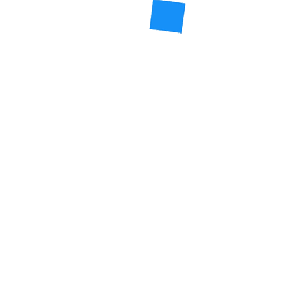
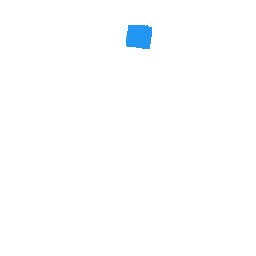
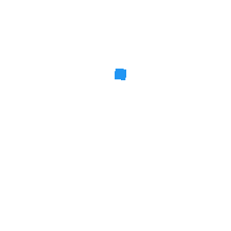
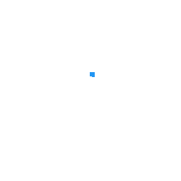

# [Loading GIFs](https://gallery.imfast.io/flutterwebsites/loadinggifs/)
[](https://github.com/Codelessly/FlutterLoadingGIFs/releases) [](https://github.com/Codelessly/FlutterLoadingGIFs/releases) [](https://github.com/Codelessly/FlutterLoadingGIFs/issues) [](https://github.com/Codelessly/FlutterLoadingGIFs) [](https://github.com/Codelessly/FlutterLoadingGIFs) [](https://libraries.io/github/Codelessly/FlutterLoadingGIFs) [](https://opensource.org/licenses/0BSD)


> ### High quality Android and iOS loading spinners.

[View Demo](https://gallery.imfast.io/flutterwebsites/loadinggifs/)

Loading GIFs is a collection of high fidelity loading animations in GIF format. Included are Android "Material Design" and iOS "Cupertino" default loading indicators.

## Usage

[](https://pub.dev/packages/loading_gifs)


Import this library into your project:

```yaml
loading_gifs: ^latest_version
```

Use `cupertinoActivityIndicator` or `circularProgressIndicator` where ever a loading GIF is needed.
```dart
FadeInImage.assetNetwork(placeholder: cupertinoActivityIndicator, image: "image.png");
```
That's it!

## Usage Tips


The `loading_gifs` library is size optimized and only includes the base asset. Control the size of the loading spinners with `scale` and `placeholderScale`.

```dart
FadeInImage.assetNetwork(placeholder: cupertinoActivityIndicator, image: "image.png", placeholderScale: 5);

Image.asset(circularProgressIndicator, scale: 10);
```

## Assets

### iOS (Cupertino) Loading Indicators

||| 
|--|--|
|[Full (159KB)](packages/cupertino_activity_indicator.gif)|[Optimized (78KB)](packages/cupertino_activity_indicator_selective.gif)|

|||| 
|--|--|--|
|[Large Square (36KB)](packages/cupertino_activity_indicator_square_large.gif)|[Medium Square (14KB)](packages/cupertino_activity_indicator_square_medium.gif)|[Small Square (7KB)](packages/cupertino_activity_indicator_square_small.gif)|

|||| 
|--|--|--|
|[Large (16KB)](packages/cupertino_activity_indicator_large.gif)|[Medium (16KB)](packages/cupertino_activity_indicator_medium.gif)|[Small (17KB)](packages/cupertino_activity_indicator_small.gif)|

### Android (Material) Loading Indicators

||| 
|--|--|
|[Full (1.13MB)](packages/circular_progress_indicator.gif)|[Optimized (263KB)](packages/circular_progress_indicator_selective.gif)|

|||| 
|--|--|--|
|[Large Square (225KB)](packages/circular_progress_indicator_square_large.gif)|[Medium Square (148KB)](packages/circular_progress_indicator_square_medium.gif)|[Small Square (100KB)](packages/circular_progress_indicator_square_small.gif)|

|||| 
|--|--|--|
|[Large (129KB)](packages/circular_progress_indicator_large.gif)|[Medium (161KB)](packages/circular_progress_indicator_medium.gif)|[Small (211KB)](packages/circular_progress_indicator_small.gif)|

## About

Here at Codelessly, we're working on #NoCode and code generation automation tools to increase productivity. If you are interested in a website builder powered by computer vision or flow-based automation, drop us a line below 😎

Loading GIFs is licensed under Zero-Clause BSD and released as Emailware. If you like this project or it helped you, please subscribe to updates. Although it is not required, you might miss the goodies we share!

<a href="https://codelessly.com" target="_blank"></a>

## Contributors ❤️

**Design:** 
* [Ray Li](https://github.com/searchy2)

**Development:** 
* [Ray Li](https://github.com/searchy2)

**Sponsor:** [Codelessly - No Code Automation Tools](https://codelessly.com)

<a href="mailto:ray@codelessly.com">
  
</a>
<a href="https://codelessly.com">
  
</a>
<a href="https://twitter.com/codelessly1">
  
</a>
<a href="https://github.com/Codelessly">
  
</a>
<br></br>
<a href="https://github.com/flutter/flutter">
  
</a>


## License

    BSD Zero Clause License

    Copyright © 2020 Codelessly

    Permission to use, copy, modify, and/or distribute this software for any
    purpose with or without fee is hereby granted.

    THE SOFTWARE IS PROVIDED "AS IS" AND THE AUTHOR DISCLAIMS ALL WARRANTIES WITH
    REGARD TO THIS SOFTWARE INCLUDING ALL IMPLIED WARRANTIES OF MERCHANTABILITY
    AND FITNESS. IN NO EVENT SHALL THE AUTHOR BE LIABLE FOR ANY SPECIAL, DIRECT,
    INDIRECT, OR CONSEQUENTIAL DAMAGES OR ANY DAMAGES WHATSOEVER RESULTING FROM
    LOSS OF USE, DATA OR PROFITS, WHETHER IN AN ACTION OF CONTRACT, NEGLIGENCE OR
    OTHER TORTIOUS ACTION, ARISING OUT OF OR IN CONNECTION WITH THE USE OR
    PERFORMANCE OF THIS SOFTWARE.